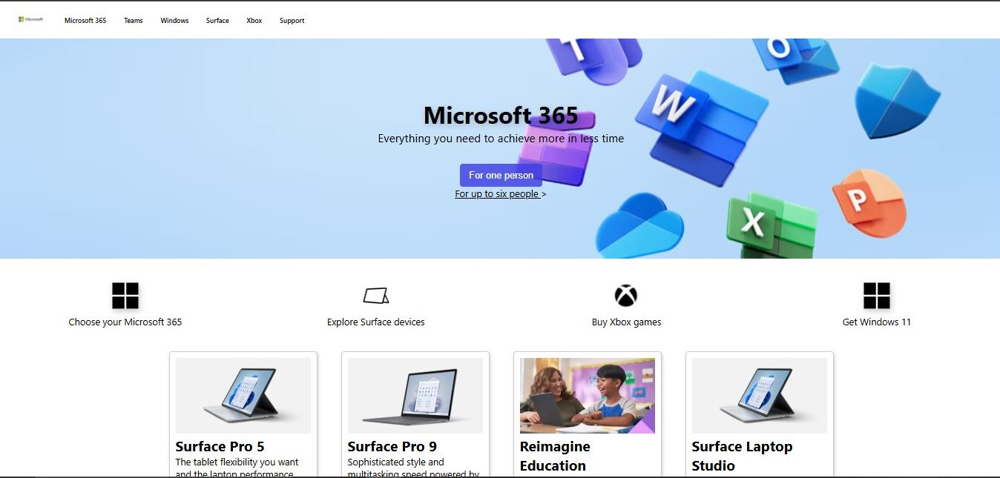

# 🖥️ Microsoft Homepage Clone

A fully responsive clone of the official Microsoft homepage built using **HTML** and **CSS**.  
This project was originally created 2 years ago when I had just learned CSS. Recently, I revisited and upgraded it with a modern, fully responsive layout to improve usability on all screen sizes.

## 🔍 Live Preview

[https://priyanshu579.github.io/cloneofMicrosoft]

## 📸 Screenshots

| Desktop View |
|  

## 🛠️ Technologies Used

- HTML5
- CSS3 (including media queries for responsiveness)
- Responsive layout with Flexbox
- Clean and semantic HTML structure

## ✨ Features

- 🔹 Microsoft-like UI with full homepage design
- 🔹 Clean, well-structured, and readable code
- 🔹 Responsive on all devices (Mobile, Tablet, and Desktop)
- 🔹 Separate CSS files for layout and media queries
- 🔹 Custom navigation bar and multiple sections including Xbox, Surface, and Microsoft 365
- 🔹 Realistic content blocks and product promotion cards

## 🧠 What I Learned

- Implementing responsive design using CSS media queries
- Using Flexbox and layout techniques for adaptive sections
- Structuring code better for real-world projects
- Rewriting and improving older code using my current front-end skills

## 🙋‍♂️ Author
**Priyanshu Sharma**  
Frontend Developer  
📧 Connect with me: [LinkedIn](linkedin.com/in/priyanshu-sharma-123408251) | [GitHub](https://github.com/Priyanshu579) 

## 📜 License

This project is created for educational and portfolio purposes only. It is not intended for commercial use or redistribution.

